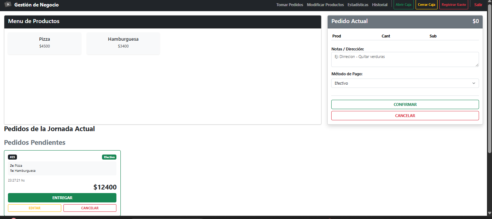
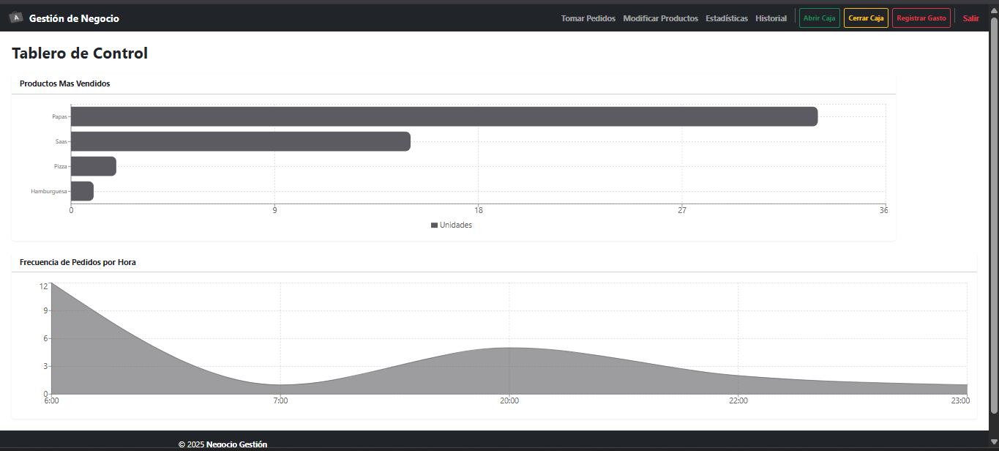
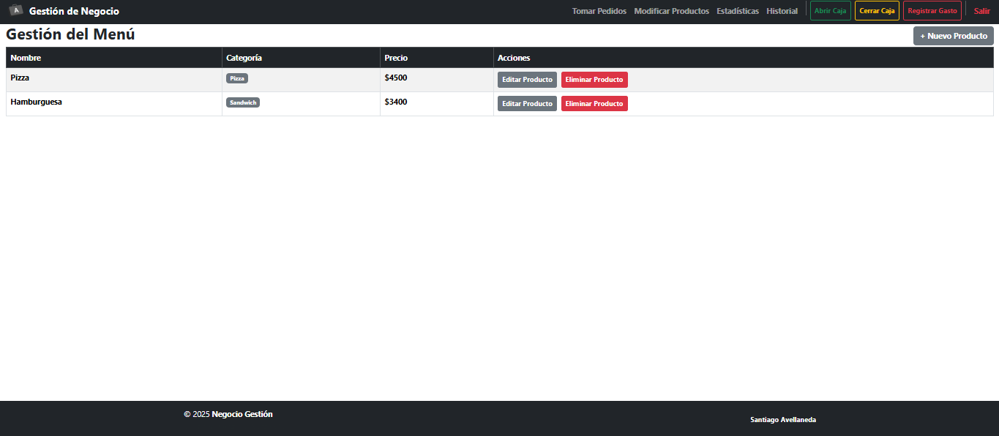
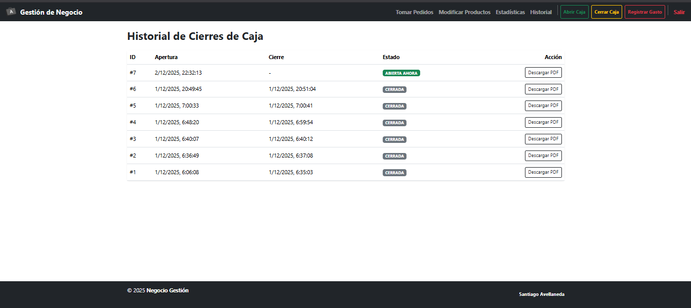
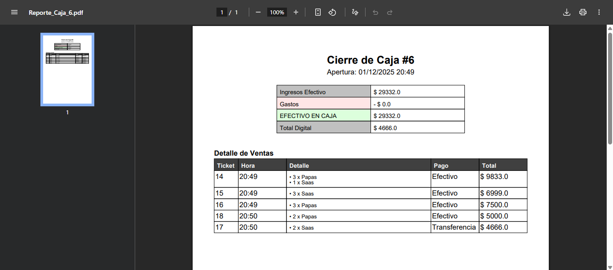

Sistema de Gestión para Pizzería

Sistema integral de punto de venta y administración desarrollado para un negocio gastronómico real. Permite la toma de pedidos, control de caja diaria, gestión de gastos y generación de reportes contables.

## Tecnologías Utilizadas
- **Backend:** Java 21, Spring Boot 3, Spring Data JPA
- **Frontend:** React.js, Vite, Bootstrap
- **Base de Datos:** PostgreSQL
- **DevOps:** Docker & Docker Compose
- **Extras:** Generación de PDFs con OpenPDF

## Funcionalidades Clave
- **Toma de Pedidos:** Interfaz visual para cargar productos y calcular totales
- **Gestión de Estados:** Control de pedidos en cocina vs. entregados
- **Cierre de Caja:** Cálculo automático de efectivo y generación de reporte PDF diario
- **Seguridad:** Validación de apertura/cierre de jornada

## Instalación Rápida (Docker)
1. Clonar el repositorio.
2. Ejecutar `docker-compose up -d`.
3. Acceder a `http://localhost:8080`.

